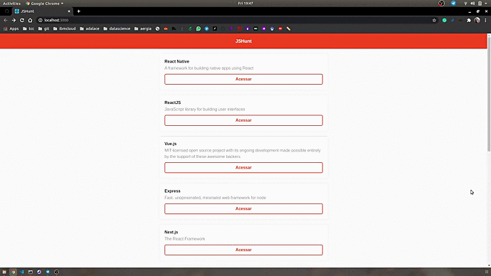

<h1 align="center">
  Huntweb
</h1>

<h4 align="center">
 Exercício de desenvolvimento do curso de reactjs, ofertado pela Rocketseat 🚀
</h4>

  
  
  

  Durante o curso foi construído uma aplicação web para listagem e apresentação dos dados da API desenvolvida no curso de nodejs, disponível no <a href="https://github.com/marismarcosta/crud-application">link</a>.

  

